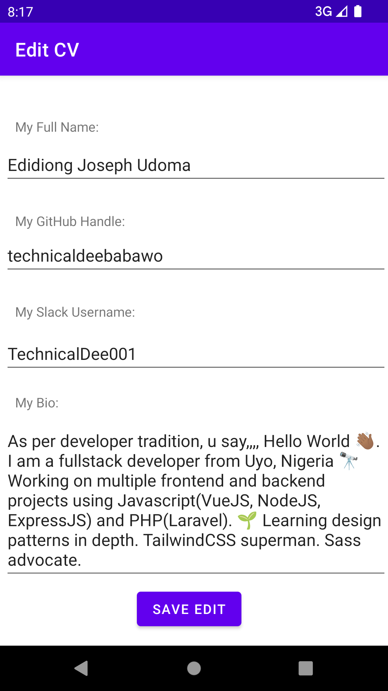

# hngx-task2
An Editable CV for zuri task2

It is built using Kotlin and it utilizes native views and sharedPreferences. No other third party packages or libraries used

To View demo:
https://appetize.io/app/kceekaq7hmticytvyfj7bimop4?device=pixel4&osVersion=11.0&scale=75

To setup:
clone repo, install dependencies and run in emulator or ./gradlew build to generate apk
